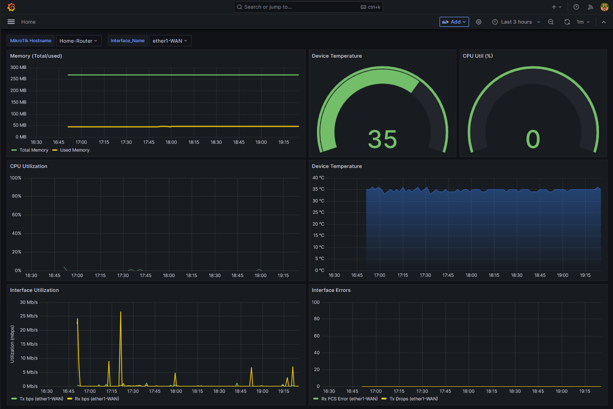

# mikrotik_perfmon

A simple demo of using MikroTik scripts to send performance data in to InfluxDB and visualize the data in Grafana.

This is not production code, but provides a useful demo of visualizing performance data in Grafana for a MikroTik device.



# Instructions

This code uses a bash script to install InfluxDB and Grafana on to an Ubuntu or Raspberry Pi device. It will also perform basic configuration of both software packages. If you're not comfortable with having these packages installed on your Linux device, do not proceed with running the installation script. 

I've done my best to ensure that the installer script will run with no issues, but your system may have some version/configuration/oddities that I can't anticipate and may not run error-free, which could leave your system in a state of having partially installed code. Do not run this on a production system and/or if you are not comfortable with being able to recover the situation yourself.

There is also a removal script to uninstall both Grafana and InfluxDB, but the same caveats apply as for the installer script. If you run the installer and it fails for some unknown reason, run the removal script to tidy things up (it *should* remove most packaged added).

Bottom line: try this out on a VM/device/system you don't care about.

## Installation

```
cd ~
git clone https://github.com/wifinigel/mikrotik_perfmon.git
cd mikrotik_perfmon/grafana
chmod +x *.sh
sudo ./install_grafana.sh
```

Once installed, follow the on-screen instructions provided at the end of the installation process to move the Mikrotik script files to your Mikrotik device and to access Grafana via its web UI.

## Removal

```
cd ~
cd mikrotik_perfmon/grafana
sudo ./remove_grafana.sh
```

## Logs

The installation process creates a log file that includes all actions, account names and passwords used during the installation process. It can be found in `~/mikrotik_perfmon/grafana/install.log`.This may help you with debugging any issues you may run into. 

If you hit issues you can't fix, you are likely best running the removal script and then re-installing (though this will wipe any performance data in the InfluxDB as the database will be removed)

# Further Info

As much as I enjoy creating & sharing code, I do not have time to maintain this repo (no PRs please). If you have any improvements, please clone this repo and publish your own version of the code and make it available to others.

Find out more scripting hits & tips at https://MikroTikScripting.com


